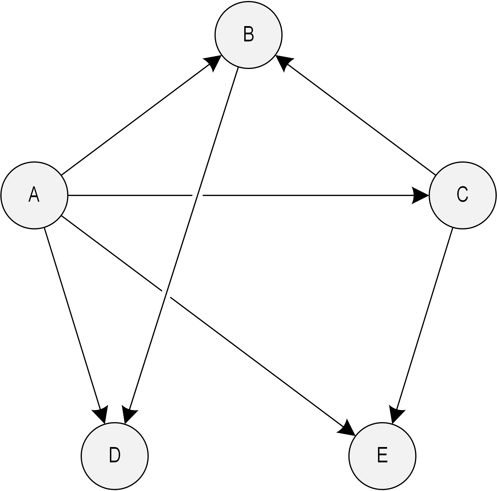

# **SWO3-Übungen - WS2023/24 - Übungszettel 4**

## **Beispiel 1: Abstrakter Datentyp "Gerichteter Graph"**

Implementieren Sie einen abstrakten Datentyp "Gerichteter Graph", verwendet für
seine interne Darstellung eine Nachbarschaftsliste (siehe dazu auch
[de.wikipedia.org/wiki/Adjazenzliste][101]). Beachten Sie auch die folgenden
Anforderungen und Hinweise:

1. Die "Payload" eines Knotens ist eine beliebig lange, dynamisch allokierte
   Zeichenkette.

1. Kanten haben keine "Payload" (also kein Gewicht etc.)

1. Die Anzahl der Knoten und Kanten, die der ADT aufnehmen kann, ist beliebig.

1. Knoten müssen dynamisch hinzugefügt und auch wieder gelöscht werden können.
   Wird ein Knoten gelöscht, so werden auch alle seine inzidenten Kanten
   gelöscht.

1. Kanten müssen hinzugefügt und auch wieder gelöscht werden können. Wird eine
   Kante hinzugefügt, so müssen seine inzidenten Knoten bereits Teil des ADTs
   sein.

1. Der ADT muss auf der Konsole entsprechend ausgegeben werden können.

1. Die Nachbarschaftsliste ist als eine Liste von Listen aufzubauen.

1. Der ADT "Gerichteter Graph" ist als Modul auszuführen.

1. Implementieren Sie ein Testmodul und testen Sie ausführlich.

[101]: https://de.wikipedia.org/wiki/Adjazenzliste
