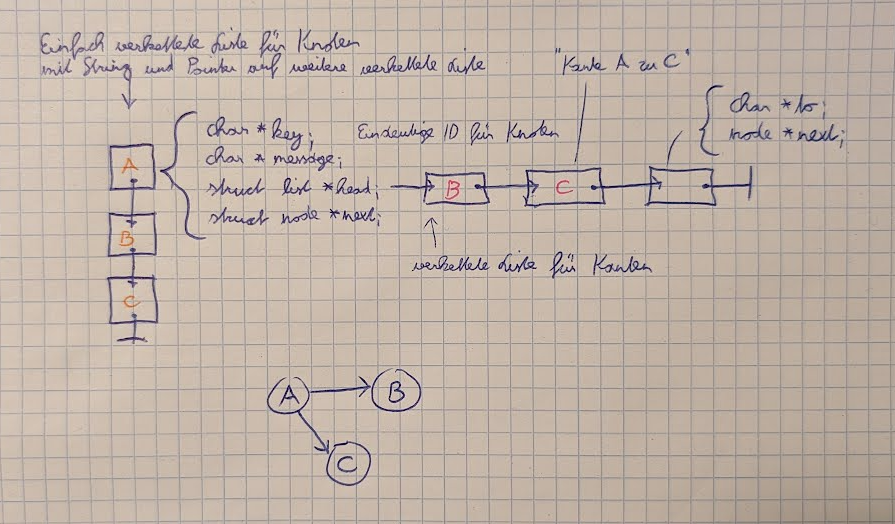
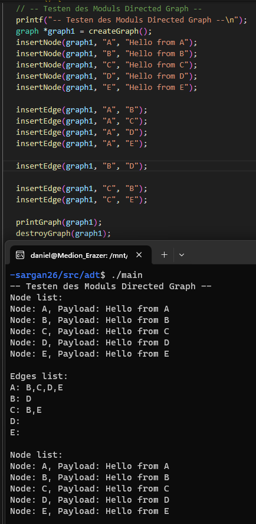
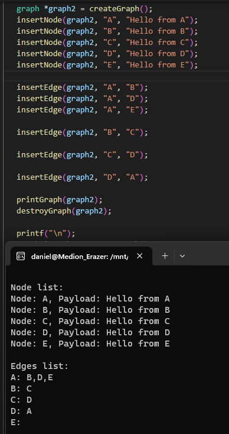
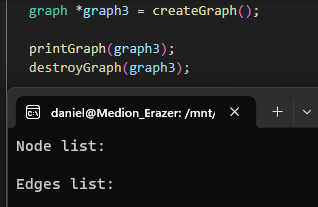
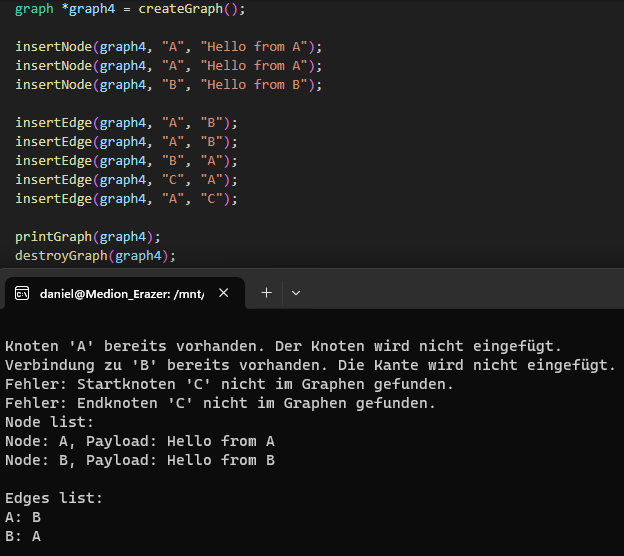
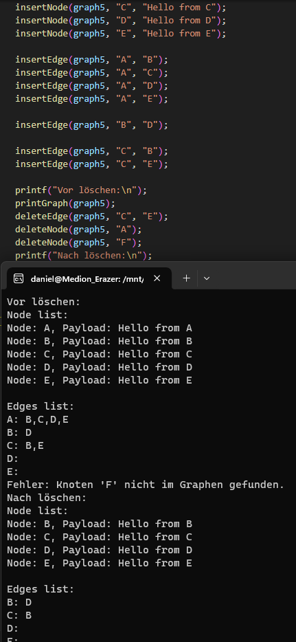

# **SWO3-Übungen - WS2023/24 - Übungszettel 4 - Ausarbeitung**

## **Beispiel 1**

### **Lösungsidee**

In der Skizze sieht man die Datenstruktur für die ich mich entschieden habe um den gerichteten Graphen zu speichern. Die Knoten werden in einer einfach verketteten Liste gespeichert. 

char *key; ... eindeutige ID für Knoten

char *message; ... payload als variable String Pointer

struct list *head; ... hier wird eine weiter einfach verkette Liste gespeichert für die Kanten

struct node *next; ... Zeiger auf den nächsten Knoten

In "struct list *head;" ist eine weitere einfach verkettete Liste, wo die Kanten gespeichert werden.

Bei dieser Aufgabe muss viel mit Pointern gearbeitet werden. Deshalb ist muss man sehr aufpassen keinen NULL Pointer zu dereferenzieren und allen allokierten Speicher wieder freizugeben.

### **Testfälle**

Normaler Graph

Normaler Graph

Leerer Graph

Test wo Knoten mehrmals eingefügt wird, wo Kanten mehrmals eingefügt werden oder so Kanten zu nicht vorhandenen Knoten eingefügt werden

Test mit dem Löschen von Knoten und Kanten